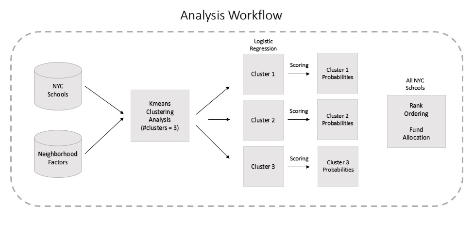
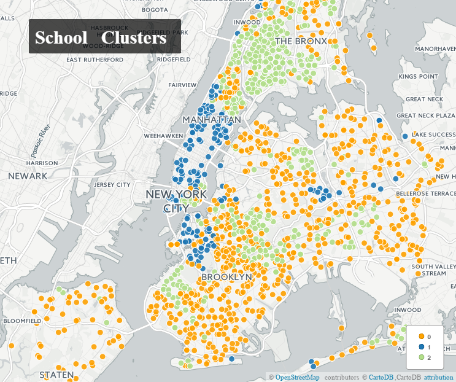
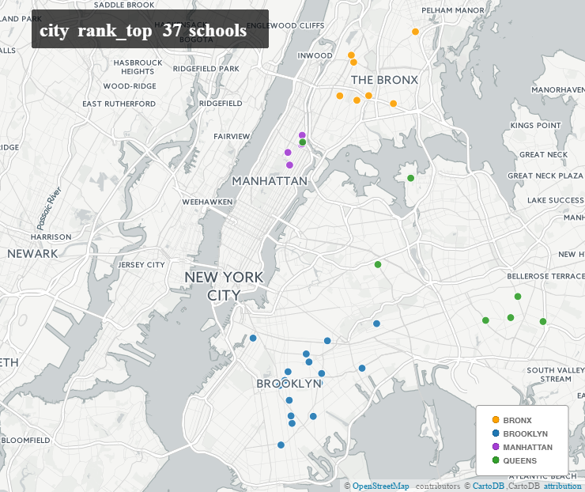
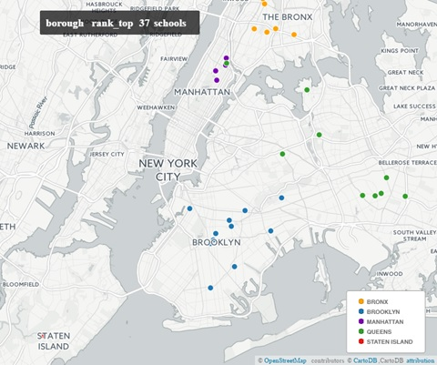
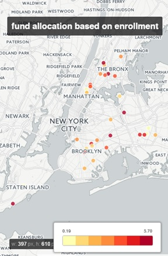

### Analysis & Results

All the data files from data processing phase are merged into a single file across each school. This master dataset contains individual 
schools at row level and corresponding neighborhood factors like number of traffic collisions, number of traffic incidents (fatalities and 
injuries), number of 311 calls made related to street quality complaints, precinct level moving summons issued and census tract level 
attributes like demographics, education and income. All the data with temporal aspect was limited only for the years 2013, 2014 and 2015.
In this phase, the merger dataset is then subjected to tasks as mentioned below:  

__1.__ Defining Traffic Risk  
__2.__ Clustering school into 3 groups based on census data  
__3.__ Logistic Regression analysis across each cluster of schools  
__4.__ Rank-Ordering of school based on traffic risk probabilities  
__5.__ Fund Allocation based on enrollment attribute for finally selected top 37 schools  

 

#### Traffic Risk
This metric is defined to capture the risk of traffic collisions around the school neighborhoods based on the data gathered earlier. In order to provide more transparency into this metric, the metric is computed as the ratio of total injuries (injuries + fatalities) to the total vehicle collisions within a school neighborhood. The reason behind defining such metric is to provide more weightage to the collisions that lead to injuries/fatalities for measuring risky school neighborhoods. A higher value of risk metric implies the extent of the collisions that happen around a school neighborhood are more likely to cause an injury or fatality. Further, using this metric a binary response variable is created using the benchmark of the entire NYC traffic risk metric under which a value of 1 means that a particular neighborhood on average performs worse than the city as a whole, and a value of 0 means that a particular school performs on average better than the city as a whole.

#### Clustering
All schools are then subjected to Kmeans clustering and divided into three groups based on the census data available at census tract 
level. This task is performed to reduce the dimensionality and also to group schools based on their socio-economic profiles. Cluster0 seems to have low density of households, average income and education levels, and medium traffic risk neighborhood conditions surrounding the schools which implies boroughs like Staten Island and a mix of Queens and Brooklyn. Cluster1 seems to have high affluent households, high qualified and low traffic risk neighbourhood conditions surrounding the schools which is more like Manhattan
borough. And Cluster2 seems to have low income, average density of households, high non schooling people and high traffic risk
neighborhood conditions surrounding the schools which is more like Bronx and certain parts of Queens and Brooklyn boroughs.

 

#### Logistic Regression
The binary response variable of traffic risk is regressed with factors like 311 calls, borough indicator, number of moving summons issued and few school level attributes. Model performances based on AUC metric seems to be 69%, 80% and 62% for clusters 1, 2 and 3 respectively. Though models are showing good accuracy levels, their performance with respect to accurate identification of schools with risk levels of 1 seems to be poor. In terms of various factors that seems to influence traffic risk conditions in school neighborhoods across three clusters:

__1.__ 311 calls seems to be indicative of low risk neighborhoods which means that any school neighborhood with higher number of 311
call complaints seem to have lower traffic risk conditions
__2.__ For borough indicators, both Manhattan and Queens seem to be indicative of low risk neighborhoods. Thus all schools present in Manhattan and Queens seems to have low traffic risk neighborhood conditions in comparison with schools in other boroughs like Bronx,
Brooklyn and Staten Island
__3.__ NYPD Moving Summons issued seem to be indicative of high risk neighborhoods. This implies that any school neighborhood with high number of summons issued tend to have high traffic risk conditions compared to others. Among different types of summons, improper turn, disobeying signal and disobeying traffic device seems to be causing high risk for traffic collisions in school neighborhoods

#### Rank Ordering
Across each cluster, logistic regression models are used on the same dataset for scoring in order to get the probabilities. After this data across schools are combined and then citybased rank ordering is applied on the entire data. The location of the top 37 schools are shown in the below map.

 

In order to ensure that all boroughs should have an equal distribution, further borough based ranking method is applied and the final list of 37 schools is shared as per the below map.

 

#### Fund Allocation
Finally, top 37 schools are then allocated the proposed investment of $60 million based on the enrollment attribute. The distributio of these funds can be seen in the below map. Further, number of intersections present in each school neighborhood can also be used for fund distribution and has been considered as next improvements of this project.

 
