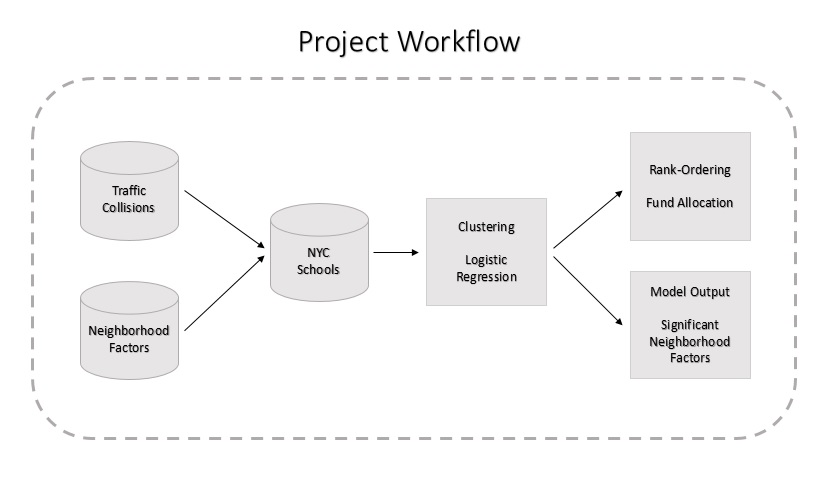

### Urban Science Intensive I Course, Spring 2016
### Project Title: __Identifying the NYC Schools with high risk of Traffic Collisions__

__Team Members:__ 
Bhagwat Singh Bisht, Bilguun Turboli, Svarmit Singh Pasricha, Kiran Venkata Palla

This repository contains all the codes and data used for performing the analysis of the social impact project.

__Problem:__
In this project, various factors that are more likely to cause traffic injuries and fatalities for children around the elementary and middle school localities are studied and top 37 schools with the highest risk are identified across all boroughs. Specifically, the following questions are addressed throughout the analysis.

__1.__ Which factors contribute more towards traffic collisions around school neighborhoods? 
__2.__ Are those school neighborhoods at high risk which have higher number of moving summons over a given period? 
__3.__ Do the street quality in the school neighborhoods has a bigger influence on the traffic collisions? 
__4.__ How do the census characteristics of given area like demographics, income and education affect the traffic collisions around school neighborhoods?

__Approach:__
To address the earlier mentioned questions and to identify the top 37 schools with high risk of traffic collisions across all boroughs, the adopted approach included the application of clustering, regression analysis and rank ordering of the schools on the gathered data around traffic collisions, 311 complaints on street quality, moving summons issues by NYPD and census demographics data. Using the regression analysis technique, a risk score is developed for each elementary and middle school in New York City and then schools are rank ordered in the decreasing order to identify schools with high risk. Further in order to ensure the equity aspect across all boroughs, another borough based ranking is implemented and final 37 schools will be selected with a distribution that is equal to that of initial distribution of schools across the boroughs.

 

__Data Sources and Processing:__
Data processing was one of the challenging aspects of this project due to a diverse set of sources. At a broader level, data was collated for elementary and middle schools in NYC and futher traffic collisions in their neighbourhoods. Additional factors in school neighborhoods like street quality, speeding and census characteristics are also captured.

__1__. _NYC Schools:_ Elementary and middle level schools in NYC are gathered with geo-locations using open data sources provided by ESRI. These data tables contained information like unique school id, name, address, zip, county, city, location details, enrollment, start grade, end grade etc. 
__2.__ _Traffic Collisions:_ NYPD motor vehicle collisions are gathered from NYC Open Data portal for the years 2013, 2014 and 2015. Using geo-location of each collision, every school is associated with their neighborhood level collisions within a fixed radius. 
__3.__ _Street Quality:_ Quality of street roads can influence the occurence of vechicular collisions and to capture this behaviour 311 calls made in each neighborhood are used as proxy to quantify the likelihood of collision that can occur within a school neighborhood. Geo-spatial analysis was used to associated 311 calls across each school neighborhood.  
__4.__ _Vehicle Speeding:_ Similar to street quality approach as a proxy for vehicular level speeding attributes, NYPD summons data available at precinct level were used. Based on school's location, each of them is associated a respective precinct and correspoind summons data across different types were aggregated for each school.  
__5.__ _Census Characteristics:_ For capturing census characteristics, each school is first mapped to its census tract and then US census level data is aggragated for each school. Various factors across different characteristics like demographics, income and education are used for the final analysis. 

More details like data extracted and relavant code used for each of these sources are shared in the Data_Processing folder.

__Analysis and Results:__
Final results and the code used to generate them are shared in the Analysis_Results folder. After the implementation of clustering, logistic regression and rank-ordering techniques, the following deliverables were achieved.

__1.__ Clusters of NYC schools based on their socio-economic profiles 
__2.__ Model outpus including performance and variable related metrics for logistic regression 
__3.__ Rank-ordering of NYC schools at city and borough level, further fund allocation is performed on the list of top 37 schools based on borough rank using school enrollment variable 

